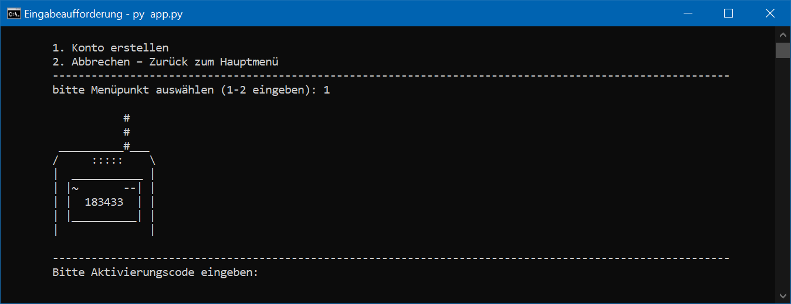

# Projekt: FoxFinance - Ein Server-Client Projekt
FoxFinance ist ein Server-Client-Projekt, das es Nutzern ermöglicht, ein Aktiendepot zu eröffnen und Aktien zu handeln.
Das Client-Programm dient als Benutzerschnittstelle, während das Server-Programm die Verwaltung von Konten und Transaktionen übernimmt. Die Daten werden in einer SQLite-Datenbank gespeichert.
- Das Client-Programm  ist eine Konsolenanwendung, umgesetzt nach dem **MVC-Pattern**.
- Das Server-Programm basiert auf einer **mehrschichtigen Architektur** (Schichtenarchitektur)
- Implementiert wurde das Projekt in **Python** unter Einsatz von **FastAPI** und **SQLite**.

**Hinweis:**  
Für Geldbeträge wurde im Programm `float` verwendet, da SQLite3 den Datentyp `Decimal` nicht unterstützt. Da die Genauigkeit in diesem Projekt nicht im Vordergrund stand, wurde in der Datenbank entsprechend der Type `REAL` verwendet.

<div style="text-align: center;">
  <b>Customer-Client Anwendung: Aktivierung des Kontos</b> <br>
<br>
  <div style="display: inline-block;  max-width: 80%; margin: 5px auto; text-align: left;">
    <p>
      Nach dem Ausfüllen des Formulars und Erstellen des Kontos muss dieses noch aktiviert werden.  
      Die Aktivierung erfolgt durch die Eingabe des Codes, der per SMS an das Mobiltelefon gesendet wird (Simulation).
    </p>
  </div>
</div>


## Inhaltsverzeichnis:
- [Verendete Technologien](#verwendete-technologien)
- [Projektvorstellung](#projektvorstellung)
- [Projektübersicht](#projektübersicht)
  - [Funktionen](#funktionen)
  - [Projektverzeichnis](#projectverzeichnis)
  - [Uml-Klassendiagramm](#uml-klassendiaggramm)
  - [Relationale Datenbankdiagramm](#relationales-datenbankmodell)
- [Screenshoots](#screenshots)
- [Installation](#installation)
- [Lizenz](#lizenz)

## Verwendete Technologien:
- Programmiersprachen:
  - Python 3.13.1
  - SQLite 3.45.3 (direkte Verwendung ohne ORM)
- Frameworks & Tools:
  - FastAPi – Framework zur Entwicklung der REST_API
  - YFinance – Bibliothek zur Abfrage von Börsendaten
  - Uvicorn – ASGI-Server für FastAPI
  - Flake8 – Tool zu Stilprüfung (PEP8) 
- weitere Bibliotheken:
  - ``os``, ``sys`` – Systemfunktionen
  - ``request`` – HTTP-Anfragen
  - ``datetime`` – Zeitverarbeitung
  - ``getpass`` – Passwort-Eingabe ohne Anzeige
  - ``jwt``, ``passlib.context`` – Authentifizierung & Passwort-Hashing
  - ``pydantic`` – Datenvalidierung
  - ``typing`` – Typannotationen
- Diagrammtools:
  - PlantUML – Erstellen von Klassendiagrammen
  - dbdiagram.io – Visualisierung des relationalen Datenbankmodells


## Projektvorstellung:

Ziel des Projekts war es, ein tieferes Verständnis von **Python** und **SQL** zu entwickeln. Aus persönlichem Interesse habe ich mich für das Thema **Aktiendepot-Simulation** entschieden, da es vielfältige Aspekte der Softwareentwicklung vereint – darunter **Datenverarbeitung, Benutzerinteraktion, Sicherheit und Datenbankanbindung**. Da sich die Projektidee gut in eine **Client-Anwendung** und ein **Server-Programm** aufteilen lässt, wollte ich außerdem praktische Erfahrung mit dem Aufbau eines vollständigen **Client-Server-Systems** und der Entwicklung einer **REST-API** sammeln.
#### Client-Anwendung
Die Client-Anwendung ist komplett objektorientiert als Konsolenprogramm im **MVC-Pattern** umgesetzt:
- **Model**: Enthält Geschäftslogik, verwaltet Daten, implementiert Validierungsregeln und enthält Funktion zur Kommunikation mit der Service-Komponente. Hilfsfunktionen wurden dort ebenfalls untergebracht.
- **View**: Zuständig für die Darstellung der Daten auf der Konsole sowie das Erfassen von Benutzereingaben. Auch die zuständigen Hilfsfunktionen befinden sich hier.
- **Controller**: Vermittelt zwischen View und Model und verarbeitet Benutzerinteraktionen.
- **Service**: Eine separate Komponente zur Abwicklung von **HTTP-Anfragen** (Senden und Empfangen).  

Einen Überblick bietet das **UML-Klassendiagramm** [siehe hier (link geplant)]. Um den Fokus auf objektorientierte Programmierung mit Python zu legen und einen zügigen Projektfortschritt zu ermöglichen, wurde bewusst eine **Konsolenanwendung** gewählt - und auf eine GUI- oder Frontend-Lösung verzichtet.  

#### Server-Programm
Im Gegensatz zur objektorientierten Client-Anwendung ist das Server-Programm strukturiert und prozedural programmiert –  mit Ausnahme der Komponente `DBOperator`, der für strukturierte Datenbankzugriffe sorgt.  
Der Server ist in folgende Schicht unterteilt:
- **API-Schicht**: Entgegennahme und Weiterleitung von **HTTP-Anfragen**, inkl. Authentifizierung über **Zugangstoken**.
- **Service-Schicht**: Enthält die Geschäftslogik und validiert Daten.  
- **Repository-Schicht**: Zuständig für **Datenbankzugriffe**  

Zusätzlich gibt es:
- **Schema**: **Pydantic-Modelle** zur Datenvalidierung und zur Definition des Datenformats.
- **Utilities**: Hilfsmodule wie z.B. Konfiguration oder gemeinsam genutzte Funktionen.
- **Logger**: Selbst entwickelter Logger für die Initialisierung und Konfiguration von Log-Date  

Für eine einheitliche und gut lesbare Codebasis kam **Flake8** zur Stilprüfung zum Einsatz. Anstelle der üblichen 80 Zeichen pro Zeile wurde die maximale Zeilenlänge projektweit auf 120 Zeichen festgelegt.  


#### SQL-Datenbank
Die Wahl fiel auf **SQLite** als Datenbank, da es sich nahtlos in Python integrieren lässt und eine praktische Erweiterung für die Entwicklungsumgebungen **Visual Studio Code** gibt. Auf den Einsatz von ORMs wie **SQLAlchemy** ist bewusst verzichtet worden, um Erfahrung mit dem direkten Umgang mit **SQL-Befehlen** zu sammeln.  

#### REST-API
Für die Umsetzung der REST-API entschied ich mich für **FASTAPi**, da mir die Dokumentation besonders zusagte. Weitere Vorteile von FASTAPi sind die native Unterstützung **asynchroner Programmierung**, die einfache **tokenbasierte Authentifizierung** (z.B. mit **JWT**) sowie eine interaktive **Swagger-Oberfläche**, mit der die API automatisch dokumentiert und getestet werden kann.

#### Börsendaten
Die Börsendaten werden mit der Python-Bibliothek **YFinance** abgerufen – einem Community-Projekt, das den Zugriff auf Finanzdaten von **Yahoo Finance** ermöglicht. Im Vergleich zu vielen kostenlosen professionellen APIs bietet YFinance weniger Einschränkungen und für die Zwecke der Simulation vollkommen ausreichend.

---
### Technische Schwerpunkte

Während des Projekts sammelte ich fundierte Erfahrungen in der **objektorientierten Programmierung**. Durch den Einsatz von **Vererbung** und die gemeinsame Nutzung von Klassen ließ sich **Code-Redundanz** vermeiden – ebenso durch die Wiederverwendung einheitlicher Funktionen nach dem Prinzip **„Don't repeat yourself“ (DRY)**.  
Ein weiterer Vorteil zeigte sich in der Verwendung von **Komposition** innerhalb der Control-Schicht: Modellbasierte Objekte wurden per **Reflektion** an die View-Schicht übergeben, wodurch Attribute dynamisch gesetzt und ausgelesen werden konnten.  
Mit der der ``property``-Funktion konnte der Zugriff auf interne Attribute gekapselt und validiert werden. 

Durch die klare Trennung von Verantwortung und Zuständigkeit entstand ein **modularer Aufbau**, so sind die beiden Anwendungen einfach erweiterbar und einfach zu Testen.

Die Tests wurden in erster Linie **manuell** durchgeführt, indem die Programme gestartet und ihre Zusammenarbeit überprüft wurde. Zusätzlich wurden einzelne Module gezielt über die Konsole getestet, z.B. mit dem Befehl: 
```bash
python -m ort.modulname
```
Es wurde eine grundlegende **Fehlerbehandlung** in der Client-Anwendung implementiert, die mithilfe von try-except-Blöcken ungültige Eingaben abfängt und benutzerfreundlich behandelt. Im Gegensatz dazu kamen beim Server **benutzerdefinierte Fehlerklassen** zum Einsatz – die Klasse ``DBOperationError``, die bei ``DBOperator`` verwendet wird, um Fehler bei Dankbankoperationen gezielt zu erfassen.  
Die Fehler werden in einen selbst entwickelten **Logger** erfasst und können je nach Konfiguration in der Konsole und/oder Datei ausgegeben werden.  

Beim Erstellen der Tabellen in der relationalen Datenbank wurde darauf geachtet das **ACID-Prinzip** einzuhalten. Eine Ausnahme bilden Postleitzahlen und Städtenamen, die der Einfachheit halber in der Tabelle ``customer_adresses`` belassen wurden. Eine Übersicht über die Datenbank bietet das **relationale Datenbankdiagramm** (link hier, geplant). Vor mehrfachen ``execute``-Befehlen wird mit ``transaction`` und ``rollback`` im ``try-except``-Block gearbeitet.


Die **HTTP-Anfragen** wurden im Client über die ``requests`` Bibliothek umgesetzt. Die genutzten HTTP-Befehle sind ``set``, ``post``, ``delete`` und ``patch``. Die Nachrichten werden mit ``.json()`` entpackt und entsprecht ihres **Statuscodes** weiterberarbeitet. Da es sich um eine Simulation handelt, wurde auf **HTTPS** verzichtet.  
Die **REST-API** sowie die Authentifizierung und Token-Erstellung wurden mithilfe des offizielen FASTAPI-Tutorials umgessetzt. Das Token wird mit Hilfe der Bibliothek ``JWT`` erstellt. Der von FASTAPi bereitgestellte Code steht unter **MIT-Lizenz** und wurde an die Projektanforderungen angepasst  – so erfolgt die Authentifizierung nicht über den Benutzername, sondern über Email und Passwort. Mit der Basisklasse ``BaseModel`` aus der Bibliothek ``pydantic`` wurden Klassen zur **Datendefinition** und **Datenvalidierung** erstellt. Diese befinden sich im Ordner ``schemas`` und sind für FASTAPI zur entgegenahme von HTTP-Anfragen erforderlich.

Die Börsendaten werden beim Start des Servers sowie bei kursrelevanten Abfragen – etwa dbei Kauf-Transaktionen – aktualisiert. Die Steuerungerfolgt über die Service-Schicht.

---
### Sicherheitsaspekte
Bei der Umsetzung des Projekts wurde auch auf die Sicherheit geachtet. So wurde nicht nur eine **Token-Authentifizierung** implementiert, sondern auch darauf geachtet, dass das Token im Client-Programm **nicht als Attribute einer Klasse** gespeichert wird.  
Darüber hinaus wird der Kunde aufgefordert, ein Passwort zu wählen, das den empfohlenen **Sicherheitsanforderungen** entspricht. Zur Aktivierung des Kontos wird eine **Zwei-Faktor-Authentifizierung** simuliert.  
Zur Gewährleistung von **Datenschutz** und **Datensicherheit** wurden die Kundendaten von Kunden in mehrere Tabelle aufgeteilt. Das **Passwort** und das **Bankkonto** werden in der Datenbank verschlüsselt gespeichert.
- Beim Passwort wird mit **Bcrypt** gehast
- Das Bankkonto wird mithilfe von **Fernet** (symmetrische Verschlüsselung) verschlüsselt.  

Die Verschlüsselung erfolgt in den **Pydantic-Datenmodellen**, sobald die Daten empfangen und validiert wurden.
Der von Fernet verwendete Schlüssel – ebenso wie der Schlüssel zur Token-Generierung – kann automatisch neu erstellt werden, wenn eine neue Datenbank mit der Server-Anwendung erzeugt wird.
In der Datenbank werden automatisch die **Login-Zeit** und die **IP-Adresse** erfasst. Außerdem wird für jede Datenbankanfrage eine Verbindung geöffnet und geschlossen.
Zur Vermeidung von **SQL-Injection** werden Benutzereingaben ausschließlich über **Platzhalter** in SQL-Befehle eingefügt.  

---
### Grenzen des Projekts
Ursprünglich war geplant einen zweites Client-Programm zuschreiben, das die **Bank-Seite** repräsentiert. Dafür wurden auch schon Kundendaten erstellt. Und es war vorgesehen, **Transaktion für die letzten Jahre** einzupflegen, um der Bank-Seite eine Grundlage für **Statistiken** zu bieten. Diese Erweiterung konnte aus **Zeitgründen** nicht realisiert werden.  
Aus demselben Grund wurde auch auf die Umsetzung der **asynchronen Programmierung** verzichtet.

---
### Fazit
Das Projekt es ein gutes Beispiel für den praktischen Einsatz beider **Programmierparadigmen**: **objektorientiert** und **prozedural**. 
Die Client-Anwendung demonstriert die Vorteile der **objektorientierten Programmierung** – etwa das Bündeln von zusammenhängenden Funktionen in Klassen, das Speichern und Verwalten von Zuständen, die Wiederverwendbarkeit durch **Vererbung**, sowie den gezielten Einsatz von **Komposition** und **Reflektion**, um dynamisch auf Attribute zuzugreifen.

Im Gegensatz dazu ist der Server bewusst **prozedural** aufgebaut. Hier zeigt sich, dass bei klar abgegrenzten Aufgaben – wie dem Verarbeiten und Weiterreichen von Daten – **Funktionen** oft völlig ausreichend sind. Gleichzeitig wird deutlich, dass es auch in prozeduralen Architekturen sinnvolle Anwendungsfälle für **Klassen** gibt: Die ``DBOperator`` etwa kapselt wiederkehrende Abläufe und Fehlerbehandlung beim Datenbankzugriff und zeigt, wie strukturierte Zustandsverwaltung auch in einem prozeduralen Kontext hilfreich sein kann.

Eine wichtige Erfahrung aus dem Projekt war, wie häufig und wiederholt getestet werden musste. Um in zukünftigen Projekten Zeit zu sparen und die Qualität zu sichern, ist einer der nächsten Schritte, sich intensiver mit **automatisierten Tests** auseinanderzusetzen.

Beim Schreiben der **SQL-Befehle** musste abgewogen werden, wie allgemein ein Befehl gestaltet werden sollte. Einerseits ist es sinnvoll, wiederverwendbare und flexible Abfragen zu formulieren, um **Redudanz** im Code zu vermeiden. Andererseits kann eine zu starke **Generalisierung** den Code unnötig komplex machen und den **Zeitaufwand** erhöhen. Ob sich dieser Mehraufwand lohnt, sollte im Vorfeld überlegt werden – insbesondere, wenn zum Zeitpunkt der Erstellung nur ein konkreter Anwendungsfall bekannt ist.

In solchen Fällen ist es oft effizienter, eine einfache, spezifische Lösung zu wählen, anstatt Zeit in die Entwicklung eines universellen Befehls zu investieren, der möglicherweise nie ausreichend mehrfach wiederverwendet das sich diese Zeit auch rentiert. Diese Abwägung zwischen **Wiederverwendbarkeit** und **Entwicklungsaufwand** war eine wichtige Erfahrung des Projekts und hat mein Verständnis für **pragmatische Softwareentwicklung** geschärft.

**Generalisierte SQL-Befehle** bergen zudem auch ein zusätzliches Sicherheitsrisiko. Ein Beispiel wäre: 
````python
sql = f"""INSERT INTO {table} ({key_column}) VALUES({key_value})"""´
````
Solche Konstrukte könnten ausgenutzt werden, um Daten in Tabellen zu verändern, für die der Befehl ursrpünglich nicht vorgesehen war. Auch wenn es sich bei diesem Projekt um eine Simulation handelt, wurde deutlich, dass **Sicherheit** nicht erst beim Zugriff auf sensible Daten beginnt.
Ein Beispiel dafür ist der bewusste **Verzicht darauf, Zugangstoken als Attribut in einer Klasse zu speichern**, um Missbrauch oder versehentliches Weitergeben zu vermeiden. Diese Erkenntnis hat mein Bewusstsein dafür geschärft, dass **sichere Softwareentwicklung** bereits bei der Gestaltung und Strukturierung des Codes beginnt.  

Das Projekt war ein spannendes und lehrreiche Erfahrung. Gleichzeitig bin ich froh, es nun abschließen zu können und mich neuen Projekten und Herausforderungen zu widmen.


## Projektübersicht

### Funktionen:
- **beim Serverstart:**
  - Prüfen, ob eine Datenbank vorhanden ist
  - Falls nicht:
    - Erstellen von neuen Schlüsseln (für Token und Kontodatenverschlüsselung)
    - Erstellen der Datenbank

- **Mit dem Client:**
  - Konto erstellen und einloggen
  - Aktien suche und handeln
  - Watchlist verwalten
  - Konto- und Depotübersicht anzeigen
  - Geld ein-/auszahlen
  - Ordergebühren anzeigen
  - Kontodaten bearbeiten
  - Abmelden oder Programm beenden


---

### Projektverzeichnis
Ein komplettes Verzeichnis findet sich hier: Link

<pre style="font-size:12px; font-family:Consolas;">
FoxFinance/
├── customer_client/
│    ├── controller/
│    ├── model/
│    ├── service/
│    ├── view/
│    └── app.py
├── docs/
│    └── imgages/
├── server/
│    ├── api/
│    ├── database/
│    │    ├── sqlite_scripts/
│    │    └── FoxFinanceData.db
│    ├── logger/
│    ├── repository/
│    ├── schemas/
│    ├── service/
│    └── main_server.py
├── LICENSE.txt
├── README.md
└── requirements.txt
</pre>
---

### UML Klassendiaggramm


#### Klassendiagramm von der Client-Anwendung

<div style="text-align: center;">
</div>

**Beschreibung:** Das Klassendiagramm zeigt zentral die Control-Schicht, welche die Steuerung des Programmablauf übernimmt. Diese Schicht steht in Verbindung mit den Model-Klassen zur Datenverarbeitung sowie der View-Klassen zur Darstellung von Informationen und Nutzereingaben.  
HTTP-Anfragen werden über die Klasse ServerRequest in der Service-Schicht abgewickelt. Diese Klasse stellt Funktionen bereit, die von den Model-Klassen aufgerufen werden können, um externe Daten zu laden oder zu senden.  
Das Diagramm ist als `.puml`-Datei im Verzeichnis /docs verfügbar.

---

#### Klassendigramm vom Server-Programm
<div style="text-align: center;">
</div>

**Beschreibung:** Das Klassendiagramm zeigt die verschiedenen Schichten des Server-Programms.

- Die **API-Schicht** ist in **Lila-Tönen** dargestellt. Sie nimmt HTTP Anfragen entgegen und sendet Antworten.
Sie steht primär in Verbindung mit der Service-Schicht, welche die Geschäftslogik enthält, sowie mit der Schema-Schicht, die die Datenklasse definiert.

- Die **Service-Schicht** ist in **Blau-Tönen** gehalten. Sie greift hauptsächlich auf die Repository-Schicht zu, welche SQl-Befehle und die DBOperator-Klasse enthält. Diese ist für die Verbindung zur SQLite-Datenbank und die Ausführung von Befehlen zuständig. 
- Die **Repository-Schicht** ist in **Grün-Tönen** dargestellt.
- Die **Utilities-Schicht** enthält Hilffunktionen und ist in **Orange-Tönen** gekennzeichnet.
- Die Verbindungen der Datei **main_server.py** sind in **Rot** dargestellt.  

Das Diagramm ist auch als `.puml`-Datei im Verzeichnis /docs verfügbar.

---

### Relationales Datenbankmodell

<div style="width: 100%; margin: 0 auto; text-align: left;">

</div>

**Beschreibung:** Das Diagramm zeigt die relationale Datenbankstruktur des Projekts. Im linken Bereich befindet sich die customer_id-Tabelle, daneben weitere Tabellen die direkt mit dem Nutzer verküpft sind. Rechts davon sind die Tabellen für  Aktientransaktionen(transactions), die Watchlist(wathlist) sowei Überweisungen(financial_transactions). 

Um das ACID-Prinzip einzuhalten, wurden zusätzliche Tabellen ergänzt, die für Konsistenz und Integrität sorgen. Ein interaktives Online-Diagramm mit ergänzenden Notizen ist auf dbdocs.io <a href="https://dbdocs.io/christian.zenger/FoxFinance?view=relationships">(Link)</a> verfügbar. Dort lassen sich unter anderem Informationen zu Unique-Constraints und Trigger einsehen. Das Diagramm ist auch als `.pdf`-Datei im Verzeichnis /docs verfügbar.


## Screenshots

<div style="width: 70%; margin: 0 auto; text-align: left;">
  <h3>Einsatzbereiter Server:</h3>

<div style="display: inline-block; margin: 5px auto; text-align: left;">
    <p>
      <b>Beschreibung:</b> Im oberen Bereich sind Statusmeldungen zur Aktienaktualisierung zu sehen. Darunter folgen Informationen zur aktuellen Serverkonfiguration sowie weitere Systemmeldungen, die den erfolgreichen Start des Servers bestätigen.
    </p>
  </div>
</div>


<div style="width: 70%; margin: 0 auto; text-align: left;">
  <h3>Hauptmenü und Depotmenü:</h3>

<div style="display: inline-block; margin: 5px auto; text-align: left;">
    <p>
      <b>Beschreibung:</b> Vom Hauptmenü gelangt man nach dem Login zum Depotmenu, von wo aus alle Funktionen des Systems erreichbar sind.
    </p>
  </div>
</div>


<div style="width: 70%; margin: 0 auto; text-align: left;">
  <h3>Konto erstellen und aktivieren:</h3>

<div style="display: inline-block;  margin: 5px auto; text-align: left;">
    <p>
      <b>Beschreibung:</b> Zur Kontoerstellung müssen persönliche Daten eingegeben werden. Vor dem Absenden werden diese zur Kontrolle angezeigt. Anschließend ist ein Aktivierungscode erforderlich, um das Konto freizuschalten (Simulation).
    </p>
  </div>
</div>


<div style="width: 70%; margin: 0 auto; text-align: left;">
  <h3>Depotübersicht:</h3>

<div style="display: inline-block; margin: 5px auto; text-align: left;">
    <p>
      <b>Beschreibung:</b> Die Depotübersicht zeigt den aktuellen Bestand an Aktien sowie deren Wertentwicklung im Portfolio.
    </p>
  </div>
</div>


<div style="width: 70%; margin: 0 auto; text-align: left;">
  <h3>Aktienaufträge der vergangenen drei Monate</h3>

<div style="display: inline-block;  margin: 5px auto; text-align: left;">
    <p>
      <b>Beschreibung:</b> Übersicht vergangener Aktientransaktionen der letzten drei Monate. Alternativ können auch die letzten 12 Monate oder ein benutzerdefinierter Zeitraum ausgewählt werden.
    </p>
  </div>
</div>


<div style="width: 70%; margin: 0 auto; text-align: left;">
  <h3>Aktiensuche:</h3>

<div style="display: inline-block;  margin: 5px auto; text-align: left;">
    <p>
      <b>Beschreibung:</b> Über die Aktiensuche lassen sich Wertpapiere finden und deren Performance über verschiedene Zeiträume (6 Monate, 1 Jahr, 2 Jahre) analysieren.
    </p>
  </div>
</div>


<div style="width: 70%; margin: 0 auto; text-align: left;">
  <h3>Aktienkauf:</h3>

<div style="display: inline-block; margin: 5px auto; text-align: left;">
    <p>
      <b>Beschreibung:</b> Beim Kauf oder Verkauf von Aktien gibt man den Namen, die Stückzahl und die gewünschte Aktion an. Vor der Ausführung wird der Auftrag zur Bestätigung nochmals angezeigt. 
    </p>
  </div>
</div>


<div style="width: 70%; margin: 0 auto; text-align: left;">
  <h3>Kontoübersicht:</h3>

<div style="display: inline-block; margin: 5px auto; text-align: left;">
    <p>
      <b>Beschreibung:</b> Die Kontoübersicht zeigt vergangene Finanztransaktionen. Hier dargestellt sind die Buchungen der letzten drei Monate. Weitere Zeiträume wie 12 Monate oder benutzerdefinierte Filter sind ebenfalls möglich. 
    </p>
  </div>
</div>


<div style="width: 70%; margin: 0 auto; text-align: left;">
  <h3>Überweisung von Geld aufs Konto:</h3>

<div style="display: inline-block; margin: 5px auto; text-align: left;">
    <p>
      <b>Beschreibung:</b> Überweisungen auf das oder vom Referenzkonto sind möglich. Im Bild ist der Ablauf einer Einzahlung dargestellt. 
    </p>
  </div>
</div>


<div style="width: 70%; margin: 0 auto; text-align: left;">
  <h3>Kontodaten ändern:</h3>

<div style="margin: 5px auto;">
    <p>
      <b>Beschreibung:</b> Unter dem Menüpunkt „Kontodaten ändern“ lassen sich persönliche Angaben wie Anschrift, Telefonnummer, Bankverbindung und Passwort aktualisieren.
    </p>
  </div>
</div>


## Installation
Voraussetzung: Python 3.10 oder neuer muss installiert sein.
### 1. Repository klonen
 ```bash
git clone https://github.com/Name/Name.git
```

### 2. In das Projektverzeichnis wechseln
 ```bash
cd FoxFinance
```

### 3. Virtuelle Umgebung einrichten und Abhängigkeiten installieren
 ```bash
python -m venv .venv
.venv\Scripts\activate # Unter Windows
# Für maxOS/Linux source .venv/bin/activate

pip install -r requirements.txt
```

### 4. Server Starten (in Shell 1)
Stelle sicher, dass die virtuelle Umgebung aktiviert ist (du erkennst das z.B. an (.venv) am Anfang der Zeile).

 ```bash
cd server
python main_server.py
```
(Pfad: ..\FoxFinance\server\main_server.py)


### 5. Client-Anwendung Starten (in Shell 2)
Auch hier: Aktiviere die virtuelle Umgebung, falls sie noch nicht aktiv ist.
 ```bash
cd customer_client
python app.py
```
(Pfad: ..\FoxFinance\customer_client\app.py)

---

## Lizenz
Dieses Projekt wurde ausschließlich zu **Lern- und Demonstrationszwecken** entwickelt.
Für Teile des Codes basieren auf der offiziellen Dokumentation bzw. den Tutorials von FASTAPI ([siehe hier](https://fastapi.tiangolo.com/de/tutorial/)). 
Diese Inhalte wurden unter der **MIT-Lizenz** veröffentlicht und in angepasster Form im Projekt verwendet.  


Der Quellcode dieses Projekts darf **für private, nicht-kommerzielle Zwecke verwendet** werden.  
Eine Weitergabe, Veränderung oder kommerzielle Nutzung ist **nur mit ausdrücklicher Genehmigung** des Autors gestattet.  
Bitte beachte, dass dieses Projekt **nicht unter einer Open-Source-Lizenz** steht, auch wenn es auf Open-Source-Komponenten basiert.

Bei Fragen oder Feedback freue ich mich über eine Nachricht.
  
  
### Verwendete Drittanbieter-Bibliotheken

Das Projekt verwendet folgende Open-Source-Bibliotheken und Tools:

- **Python 3.13.1** – [PSF License](https://docs.python.org/3/license.html)
- **SQLite 3.45.3** – [Public Domain](https://www.sqlite.org/copyright.html)
- **FastAPI** – [MIT License](https://github.com/fastapi/fastapi/blob/master/LICENSE)
- **Uvicorn** – [BSD License](https://github.com/encode/uvicorn/blob/master/LICENSE.md)
- **YFinance** – [Apache 2.0 License](https://github.com/ranaroussi/yfinance/blob/main/LICENSE)
- **Flake8** – [MIT License](https://github.com/PyCQA/flake8/blob/main/LICENSE)
- Weitere Bibliotheken wie `requests`, `pydantic`, `jwt`, `passlib`, etc. stehen ebenfalls unter Open-Source-Lizenzen.

Bitte beachte die jeweiligen Lizenzbedingungen bei Weiterverwendung.
