# 🦊 FoxFinance – Eine Aktiendepot-Simulation mit Python & FastAPI

**FoxFinance** ist ein vollständiges Server-Client-Projekt, mit dem Benutzer ein digitales Aktiendepot eröffnen und verwalten können. Der **Client** ist eine objektorientierte Konsolenanwendung im **MVC-Stil**, während der **Server** im prozeduralen Stil nach einer klaren, mehrschichtigen Architektur aufgebaut ist – mit **FastAPI** als Framework für die REST-API und **SQLite** als Datenbanklösung folgt.

Ziel des Projekts war es, die praktische Umsetzung eines vollständigen REST-basierten Client-Server-Systems zu erlernen – mit besonderem Fokus auf **Sicherheit**, **strukturierter Softwarearchitektur** und direkter **SQL-Kontrolle ohne ORM**.

---

### Highlights

- **Komplette Client-Server-Architektur**
- Fokus auf **Sicherheit**, **SQL-Datenhaltung**, **Token-Authentifizierung**
- Implementiert in **Python** mit direktem SQL-Zugriff (kein ORM)
- Client folgt **MVC-Architektur** mit objektorientierter Struktur
- Integrierte Features: Zwei-Faktor-Login, Watchlist, Ordergebühren, Passwort-Hashing, Datenverschlüsselung

---

## Inhaltsverzeichnis

- [Verwendete Technologien](#verwendete-technologien)
- [Projektvorstellung](#projektvorstellung)
- [Funktionen](#funktionen)
- [Projektverzeichnis](#projektverzeichnis)
- [UML-Klassendiagramm](#uml-klassendiagramm)
- [Relationales Datenbankmodell](#relationales-datenbankmodell)
- [Screenshots](#screenshots)
- [Installation](#installation)
- [Lizenz](#lizenz)

<hr style="border: 1px solid #ccc;" />

## Verwendete Technologien

#### Programmiersprachen & Datenbanken
- Python 3.13.1
- SQLite 3.45.3

#### Frameworks & Tools
- FastAPI – Entwicklung der REST-API
- YFinance – Live-Aktienkurse
- Uvicorn – ASGI-Server
- Flake8 – Stilprüfung (Konfiguriert auf max. 120 Zeichen pro Zeile)
- Visual Studio Code + SQLite Viewer Extension
- DB Browser for SQLite

Weitere Bibliotheken
- `os`, `sys`, `datetime`, `getpass`, `typing`
- `requests` – HTTP-Kommunikation
- `pydantic` – Datenvalidierung
- `jwt`, `passlib.context` – Authentifizierung
- `cryptography.fernet` – Datenverschlüsselung

Diagramm-Tools
- PlantUML – Klassendiagramme
- dbdiagram.io – Datenbankmodell

<br>
<hr style="border: 1px solid #ccc;" />
<br>

## Projektvorstellung

Das Projekt entstand mit dem Ziel, praktische Erfahrung in folgenden Bereichen zu sammeln:
- Aufbau und Strukturierung eines **RESTful Client-Server-Systems**
- Umsetzung sicherer **Benutzerauthentifizierung** mit JWT und Hashing
- Verarbeitung und Speicherung von Börsendaten mit **SQL**
- Anwendung von **OOP** und MVC im Konsolen-Client
- Verwendung direkter SQL-Abfragen zur Einhaltung des **ACID-Prinzips**

---

### Client – OOP & MVC

- **Model:** Datenhaltung, Validierung, Serverkommunikation
- **View:** Konsolenausgabe & Eingabeverarbeitung
- **Controller:** Koordination der Programmabläufe
- **Service:** Kapselung der HTTP-Kommunikation

#### Besonderheiten:

- Einsatz von **Vererbung**, **Komposition** und **Reflexion** zur Wiederverwendung von Logik
- **Keine GUI**: Fokus liegt auf klarer Struktur und objektorientierter Programmierung

---

### Server – REST-API mit FastAPI

Die Serveranwendung folgt einer **Schichtenarchitektur**:

- **API-Schicht:** Endpunkte mit FastAPI inkl. JWT-Login
- **Service-Schicht:** Geschäftslogik & Validierungen
- **Repository-Schicht:** SQL-Operationen mit `sqlite3`

zusätzliche Komponenten  
- **Database:** Sqlite-Datenbank und Update-Skript beim Serverstart
  - **SQLite Scripts:**  Skripte zur Erstellung von Tabellen und Einlesen von Beispiel- und Aktiendaten
- **Schemas:** Pydantic-Modelle für Anfrage- & Antwortdaten
- **Utilities:** Hilfsfunktionen
- **Logger:** Logging-Komponente
  - **Log Files:** Logging-Ausgaben als `.txt`-Dateien

---

### Datenbank & Sicherheit

Daten werden in einer **SQLite-Datenbank** gespeichert – vollständig ohne ORM. Im Fokus standen folgende Aspekte:

- **ACID-Konformität** mit Transaktionen und Rollback
- **Sicherheitsfunktionen:**
  - Passwörter werden mit **Bcrypt** gehasht
  - Bankdaten sind mit **Fernet** symmetrisch verschlüsselt
  - Schutz vor SQL-Injection **parametrisierte Abfragen**
  - Login-Protokollierung mit Zeitstempel und IP
  - **Trennung sensibler Kundendaten** (z. B. Adressdaten, Finanzdaten, Zugangsdaten) zur Minimierung von Risiken bei Datenlecks

---

### Fehlerbehandlung

- **Client:**
  - Eingabeüberprüfung zur Vermeidung ungültiger Werte mit benutzerfreundlicher Rückmeldung
  - Grundlegende Fehlerbehandlung sowie Umgang mit HTTP-Fehlern

- **Server:**
  - Automatische Datenvalidierung durch Pydantic-Modelle beim Empfang von API-Anfragen
  - Verwendung eigener Exception-Klassen zur gezielten Unterscheidung von Fehlerursachen (z. B. Datenbankfehler)
  - **Selbstentwickelter Logger** zur Speicherung und Ausgabe von Fehler- und Statusmeldungen
  - Zentrale Fehlerbehandlungsfunktion zur konsistenten Reaktion auf unterschiedliche Fehlertypen
  - Fehlernachrichten enthalten kontextbezogene Informationen wie SQL-Query, Benutzerinput und Funktionsname
  - Benutzerfreundliche HTTP-Antworten mit passenden Statuscodes und verständlichen Fehlermeldungen

---

### REST-API & Börsendaten

Die REST-API mit FastAPI umfasst u. a.:

- Automatisch generierte API-Dokumentation via Swagger UI
- Tokenbasierte Authentifizierung via JSON Web Tokens (JWT)
- Alle API-Endpunkte sind asynchron (`async def`) und unterstützen `await`-fähige Funktionen – bereit für parallele Verarbeitung
- Nutzung von HTTP-Methoden: GET, POST, DELETE und PATCH
- Interner Finanzdatenabruf mit YFinance und Speicherung der Börsendaten

---

### Erfahrung und Erkenntnisse:

Das Projekt zeigt den praktischen Einsatz sowohl **objektorientierter** als auch **prozeduraler Programmierung**:

- **Objektorientierte Programmierung** ist ideal für den Client, da man typische Merkmale wie Zustandsverwaltung, Wiederverwendbarkeit (Vererbung, Komposition) und Reflektion gezielt einsetzen kann.
- **Prozedurale Struktur** auf dem Server ermöglicht einfache, nachvollziehbare Datenflüsse.
- **Allerdings** zeigten sich auch Grenzen und bewusste Abweichungen: Auf dem Client wurde die Wiederverwendung von Funktionen prozedural umgesetzt, da dies für kleinere, klar abgegrenzte Aufgaben praktikabler war. Umgekehrt wurde auf dem Server der Datenbankzugriff objektorientiert realisiert – durch die Kapselung von Kommandos wie connect, execute und rollback in einer Klasse konnte die Logik sauber gebündelt und wiederverwendbar gestaltet werden.

**Wichtige Erkenntnisse:**

- **Tests:** Häufiges manuelles Testen hat gezeigt, wie wichtig automatisierte Tests für zukünftige Projekte sind.
- **Fehlerbehandlung:** Debugging war ein zentraler Bestandteil der Entwicklung – das gezielte Lesen und Verstehen von Fehlermeldungen ist essenziell für effizientes Arbeiten.
- **SQL-Design:** Die Balance zwischen Wiederverwendbarkeit und Einfachheit ist entscheidend – nicht jede Abfrage muss maximal flexibel sein.
- **Pragmatisches Arbeiten:** Manchmal ist eine einfache, spezifische Lösung sinnvoller als eine übergeneralisierte, die kaum wiederverwendet wird.

Das Projekt hat meine technischen Fähigkeiten in Python und SQL deutlich erweitert – und mir gezeigt, wie zentral sauberes Debugging, Fehlermeldungen und gezielte Planung für effiziente Entwicklung sind.

---

### Ausblick

Geplante, aber nicht umgesetzte Features:

- Separater **Bank-Client** mit Statisiken und Verwaltungsfunktionen für die Bankseite 
- Implementierung der **Uvicorn-Servermeldungen in das bestehende Logging-System

---

## TL;DR – Warum dieses Projekt relevant ist:

- Vollständiges Client-Server-System mit REST-API
- Fokus auf Sicherheit und sauberen SQL-Code
- Demonstration moderner Python-Entwicklung
- Klare Schichten- & Modulstruktur
- Erweiterbare Architektur (Async, GUI etc.)

<hr style="border: 1px solid #ccc;" />

## Funktionen

### Beim Serverstart:

- Überprüfung, ob Datenbank vorhanden ist
- Falls nicht:
  - Generierung von Schlüsseln (JWT, Verschlüsselung)
  - Erstellung der Tabellenstruktur
  - Einlesen von Kundendaten und Beispieldepot

### Mit dem Client:

- Konto erstellen & aktivieren (Zwei-Faktor, simuliert)
- Login mit Token-Erstellung
- Aktien suchen & handeln
- Watchlist verwalten
- Depot- & Kontostand einsehen
- Geld ein-/auszahlen
- Kontodaten ändern
- Programm beenden oder abmelden

<hr style="border: 1px solid #ccc;" />

## Projektverzeichnis
Eine vollständige Übersicht über die Projektstruktur befindet sich [hier](https://github.com/devZenger/FoxFinance/blob/main/docs/verzeichnis.md).

```plaintext
FoxFinance/
├── customer_client/
│   ├── controller/
│   ├── model/
│   ├── service/
│   ├── view/
│   └── app.py
├── server/
│   ├── api/
│   ├── database/
│   │   ├── sqlite_scripts/
│   │   └── FoxFinanceData.db
│   ├── logger/
│   ├── repository/
│   ├── schemas/
│   ├── service/
│   └── main_server.py
├── docs/
│   └── images/
├── LICENSE.txt
├── README.md
└── requirements.txt
```

<hr style="border: 1px solid #ccc;" />

## UML Klassendiaggramm

#### Klassendiagramm von der Client-Anwendung

<div style="text-align: center;">
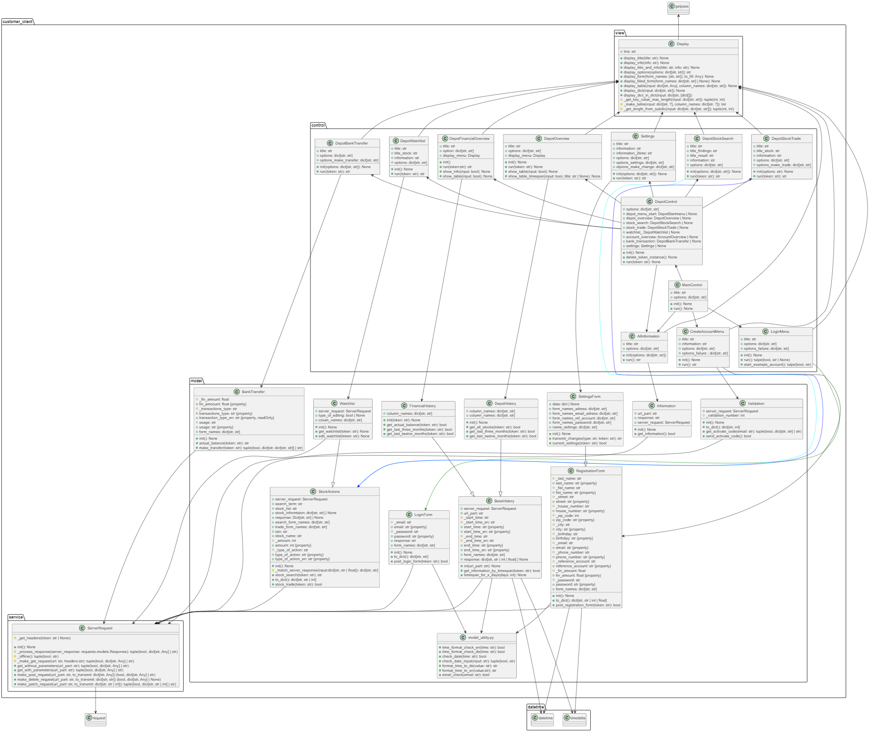</div>

**Beschreibung:** Das Klassendiagramm zeigt zentral die Control-Schicht, welche die Steuerung des Programmablauf übernimmt. Diese Schicht steht in Verbindung mit den Model-Klassen zur Datenverarbeitung sowie der View-Klassen zur Darstellung von Informationen und Nutzereingaben.  
HTTP-Anfragen werden über die Klasse ServerRequest in der Service-Schicht abgewickelt. Diese Klasse stellt Funktionen bereit, die von den Model-Klassen aufgerufen werden können, um externe Daten zu laden oder zu senden.  
Das Diagramm ist als `.puml`-Datei im Verzeichnis /docs verfügbar.

---

#### Mudolübersicht vom Server-Programm
<div style="text-align: center;">
</div>

**Beschreibung:** Das Diagramm zeigt die modulare Struktur des Server-Programms und veranschaulicht die Beziehungen zwischen den einzelnen Python-Dateien (Modulen) in einer mehrschichtigen Architektur.

- Die **API-Schicht** ist in **Lila-Tönen** dargestellt. Sie nimmt HTTP Anfragen entgegen und sendet Antworten.
Sie steht primär in Verbindung mit der Service-Schicht, welche die Geschäftslogik enthält, sowie mit der Schema-Schicht, die die Datenklasse definiert.

- Die **Service-Schicht** ist in **Blau-Tönen** gehalten. Sie greift hauptsächlich auf die Repository-Schicht zu, welche SQl-Befehle und die DBOperator-Klasse enthält. Diese ist für die Verbindung zur SQLite-Datenbank und die Ausführung von Befehlen zuständig. 
- Die **Repository-Schicht** ist in **Grün-Tönen** dargestellt.
- Die **Utilities-Schicht** enthält Hilffunktionen und ist in **Orange-Tönen** gekennzeichnet.
- Die Verbindungen der Datei **main_server.py** sind in **Rot** dargestellt.  

Das Diagramm ist auch als `.puml`-Datei im Verzeichnis /docs verfügbar.

---

## Relationales Datenbankmodell

<div style="width: 100%; margin: 0 auto; text-align: left;">
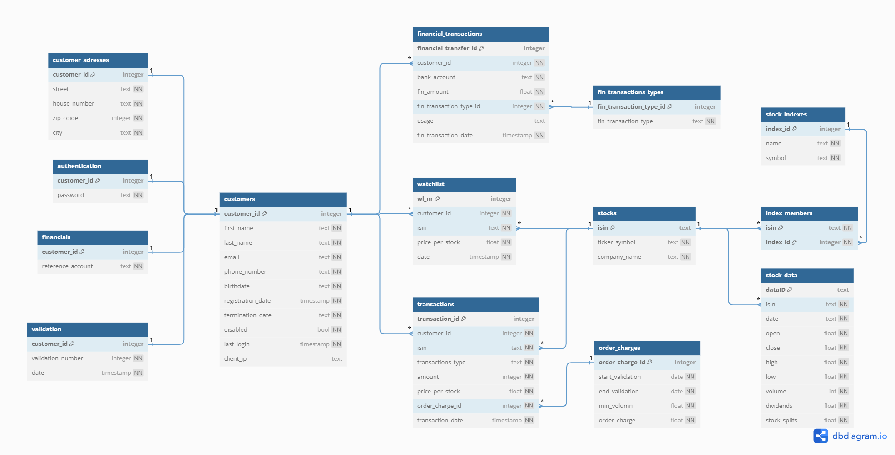
</div>

**Beschreibung:** Das Diagramm zeigt die relationale Datenbankstruktur des Projekts. Im linken Bereich befindet sich die customer_id-Tabelle, daneben weitere Tabellen die direkt mit dem Nutzer verküpft sind. Rechts davon sind die Tabellen für  Aktientransaktionen(transactions), die Watchlist(wathlist) sowei Überweisungen(financial_transactions). 

Um das ACID-Prinzip einzuhalten, wurden zusätzliche Tabellen ergänzt, die für Konsistenz und Integrität sorgen. Ein interaktives Online-Diagramm mit ergänzenden Notizen ist auf dbdocs.io <a href="https://dbdocs.io/test/FoxFinance?view=relationships">(Link)</a> verfügbar. Dort lassen sich unter anderem Informationen zu Unique-Constraints und Trigger einsehen. Das Diagramm ist auch als `.pdf`-Datei im Verzeichnis /docs verfügbar.


## Screenshots

<div style="width: 70%; margin: 0 auto; text-align: left;">
  <h3>Einsatzbereiter Server:</h3>
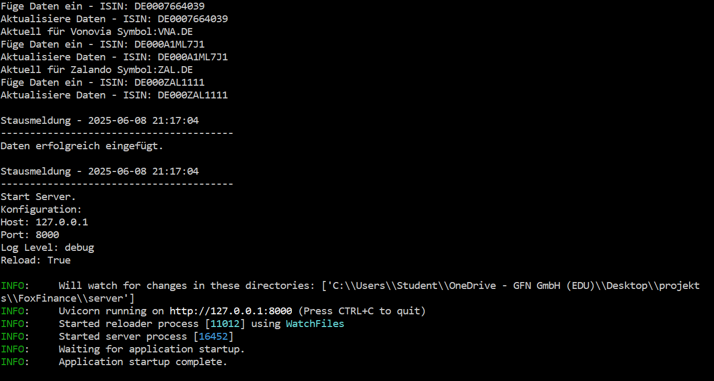
<div style="display: inline-block; margin: 5px auto; text-align: left;">
    <p>
      <b>Beschreibung:</b> Im oberen Bereich sind Statusmeldungen zur Aktienaktualisierung zu sehen. Darunter folgen Informationen zur aktuellen Serverkonfiguration sowie weitere Systemmeldungen, die den erfolgreichen Start des Servers bestätigen.
    </p>
  </div>
</div>


<div style="width: 70%; margin: 0 auto; text-align: left;">
  <h3>Hauptmenü und Depotmenü:</h3>
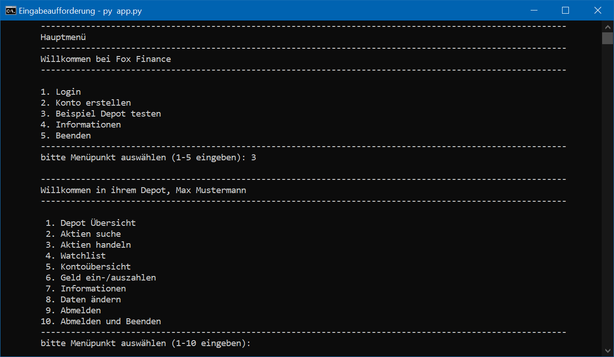
<div style="display: inline-block; margin: 5px auto; text-align: left;">
    <p>
      <b>Beschreibung:</b> Vom Hauptmenü gelangt man nach dem Login zum Depotmenu, von wo aus alle Funktionen des Systems erreichbar sind.
    </p>
  </div>
</div>


<div style="width: 70%; margin: 0 auto; text-align: left;">
  <h3>Konto erstellen und aktivieren:</h3>
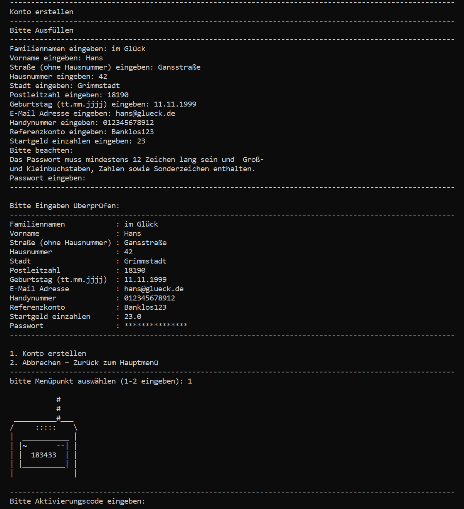
<div style="display: inline-block;  margin: 5px auto; text-align: left;">
    <p>
      <b>Beschreibung:</b> Zur Kontoerstellung müssen persönliche Daten eingegeben werden. Vor dem Absenden werden diese zur Kontrolle angezeigt. Anschließend ist ein Aktivierungscode erforderlich, um das Konto freizuschalten (Simulation).
    </p>
  </div>
</div>


<div style="width: 70%; margin: 0 auto; text-align: left;">
  <h3>Depotübersicht:</h3>
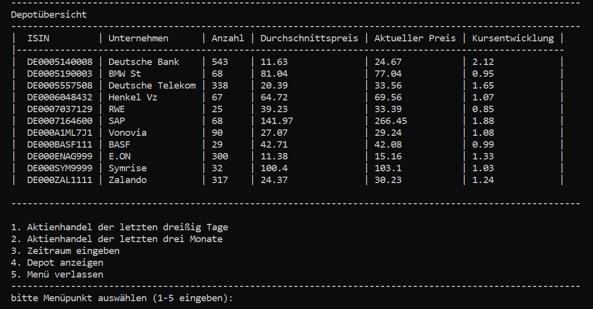
<div style="display: inline-block; margin: 5px auto; text-align: left;">
    <p>
      <b>Beschreibung:</b> Die Depotübersicht zeigt den aktuellen Bestand an Aktien sowie deren Wertentwicklung im Portfolio.
    </p>
  </div>
</div>


<div style="width: 70%; margin: 0 auto; text-align: left;">
  <h3>Aktienaufträge der vergangenen drei Monate</h3>
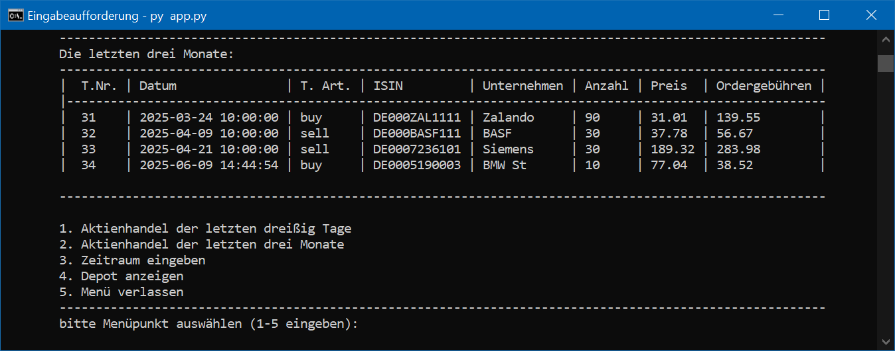
<div style="display: inline-block;  margin: 5px auto; text-align: left;">
    <p>
      <b>Beschreibung:</b> Übersicht vergangener Aktientransaktionen der letzten drei Monate. Alternativ können auch die letzten 12 Monate oder ein benutzerdefinierter Zeitraum ausgewählt werden.
    </p>
  </div>
</div>


<div style="width: 70%; margin: 0 auto; text-align: left;">
  <h3>Aktiensuche:</h3>
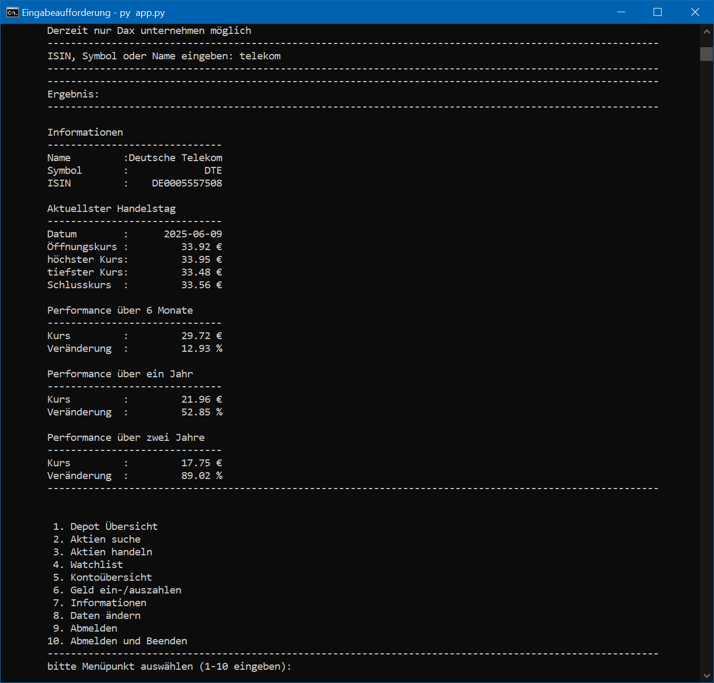
<div style="display: inline-block;  margin: 5px auto; text-align: left;">
    <p>
      <b>Beschreibung:</b> Über die Aktiensuche lassen sich Wertpapiere finden und deren Performance über verschiedene Zeiträume (6 Monate, 1 Jahr, 2 Jahre) analysieren.
    </p>
  </div>
</div>


<div style="width: 70%; margin: 0 auto; text-align: left;">
  <h3>Aktienkauf:</h3>
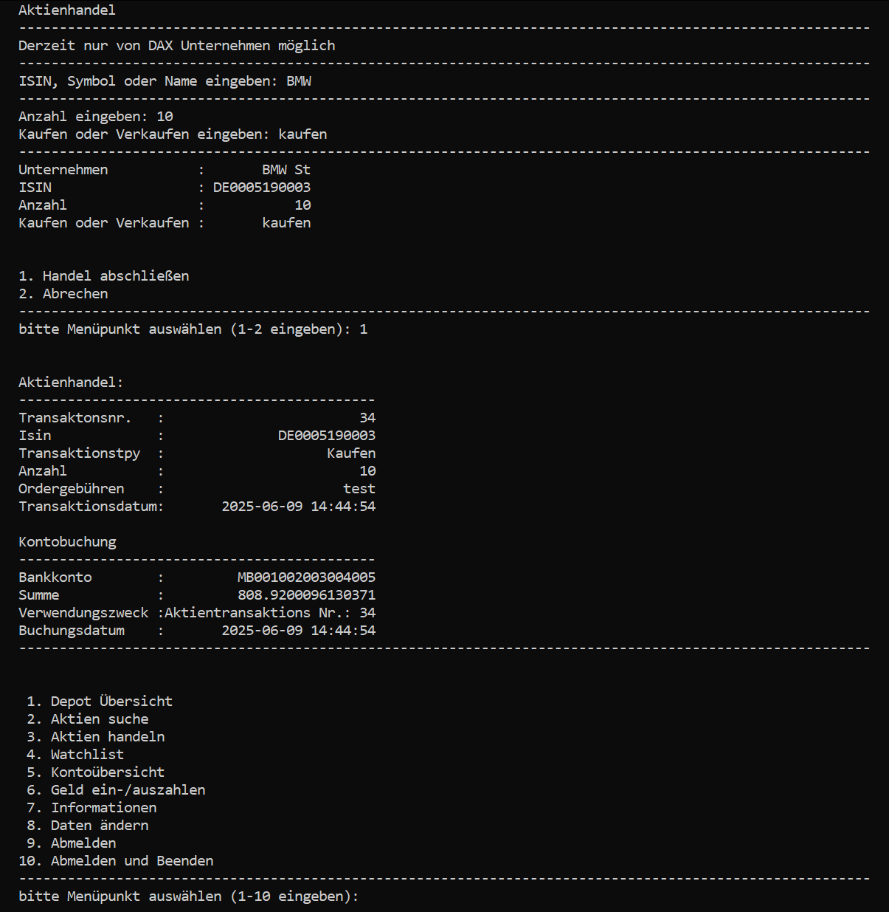
<div style="display: inline-block; margin: 5px auto; text-align: left;">
    <p>
      <b>Beschreibung:</b> Beim Kauf oder Verkauf von Aktien gibt man den Namen, die Stückzahl und die gewünschte Aktion an. Vor der Ausführung wird der Auftrag zur Bestätigung nochmals angezeigt. 
    </p>
  </div>
</div>


<div style="width: 70%; margin: 0 auto; text-align: left;">
  <h3>Kontoübersicht:</h3>
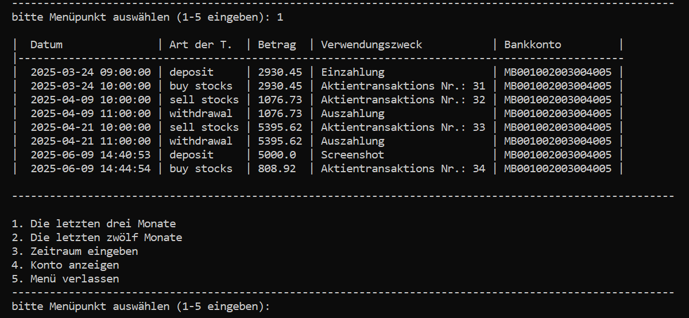
<div style="display: inline-block; margin: 5px auto; text-align: left;">
    <p>
      <b>Beschreibung:</b> Die Kontoübersicht zeigt vergangene Finanztransaktionen. Hier dargestellt sind die Buchungen der letzten drei Monate. Weitere Zeiträume wie 12 Monate oder benutzerdefinierte Filter sind ebenfalls möglich. 
    </p>
  </div>
</div>


<div style="width: 70%; margin: 0 auto; text-align: left;">
  <h3>Überweisung von Geld aufs Konto:</h3>
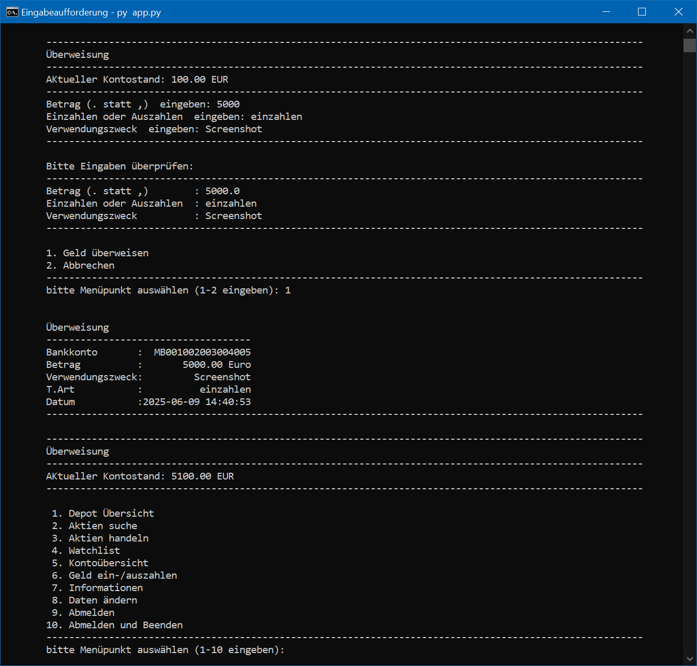
<div style="display: inline-block; margin: 5px auto; text-align: left;">
    <p>
      <b>Beschreibung:</b> Überweisungen auf das oder vom Referenzkonto sind möglich. Im Bild ist der Ablauf einer Einzahlung dargestellt. 
    </p>
  </div>
</div>


<div style="width: 70%; margin: 0 auto; text-align: left;">
  <h3>Kontodaten ändern:</h3>
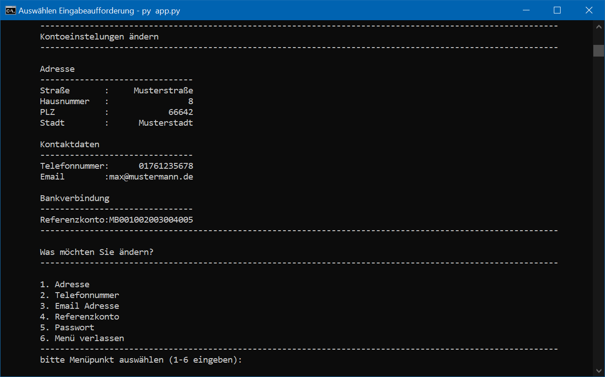
<div style="margin: 5px auto;">
    <p>
      <b>Beschreibung:</b> Unter dem Menüpunkt „Kontodaten ändern“ lassen sich persönliche Angaben wie Anschrift, Telefonnummer, Bankverbindung und Passwort aktualisieren.
    </p>
  </div>
</div>


<hr style="border: 1px solid #ccc;" />


## Installation
Voraussetzung: Python 3.10 oder neuer muss installiert sein.
### 1. Repository klonen
 ```bash
git clone https://github.com/devZenger/FoxFinance.git
```

### 2. In das Projektverzeichnis wechseln
 ```bash
cd FoxFinance
```

### 3. Virtuelle Umgebung einrichten und Abhängigkeiten installieren
 ```bash
python -m venv .venv
.venv\Scripts\activate # Unter Windows
# Für maxOS/Linux source .venv/bin/activate

pip install -r requirements.txt
```

### 4. Server Starten (in Shell 1)
Stelle sicher, dass die virtuelle Umgebung aktiviert ist (du erkennst das z.B. an (.venv) am Anfang der Zeile).

 ```bash
cd server
python main_server.py
```
(Pfad: ..\FoxFinance\server\main_server.py)


### 5. Client-Anwendung Starten (in Shell 2)
Auch hier: Aktiviere die virtuelle Umgebung, falls sie noch nicht aktiv ist.
 ```bash
cd customer_client
python app.py
```
(Pfad: ..\FoxFinance\customer_client\app.py)

<hr style="border: 1px solid #ccc;" />

## Lizenz
Copyright (c) 2025 Christian Zenger  
GitHub: https://github.com/devZenger/FoxFinance  

Dieses Projekt wurde ausschließlich zu **Lern- und Demonstrationszwecken** entwickelt.
Für Teile des Codes basieren auf der offiziellen Dokumentation bzw. den Tutorials von FASTAPI ([siehe hier](https://fastapi.tiangolo.com/de/tutorial/)). 
Diese Inhalte wurden unter der **MIT-Lizenz** veröffentlicht und in angepasster Form im Projekt verwendet.  


Der Quellcode dieses Projekts darf **für private, nicht-kommerzielle Zwecke verwendet** werden.  
Eine Weitergabe, Veränderung oder kommerzielle Nutzung ist **nur mit ausdrücklicher Genehmigung** des Autors gestattet.  
Bitte beachte, dass dieses Projekt **nicht unter einer Open-Source-Lizenz** steht, auch wenn es auf Open-Source-Komponenten basiert.

Bei Fragen oder Feedback freue ich mich über eine Nachricht.
  
  
### Verwendete Drittanbieter-Technologien

Das Projekt verwendet folgende Open-Source-Bibliotheken und Tools:

- **Python 3.13.1** – [PSF License](https://docs.python.org/3/license.html)
- **SQLite 3.45.3** – [Public Domain](https://www.sqlite.org/copyright.html)
- **FastAPI** – [MIT License](https://github.com/fastapi/fastapi/blob/master/LICENSE)
- **Uvicorn** – [BSD License](https://github.com/encode/uvicorn/blob/master/LICENSE.md)
- **YFinance** – [Apache 2.0 License](https://github.com/ranaroussi/yfinance/blob/main/LICENSE)
- **Flake8** – [MIT License](https://github.com/PyCQA/flake8/blob/main/LICENSE)
- Weitere Bibliotheken wie `requests`, `pydantic`, `jwt`, `passlib`, etc. stehen ebenfalls unter Open-Source-Lizenzen.

Bitte beachte die jeweiligen Lizenzbedingungen bei Weiterverwendung.
